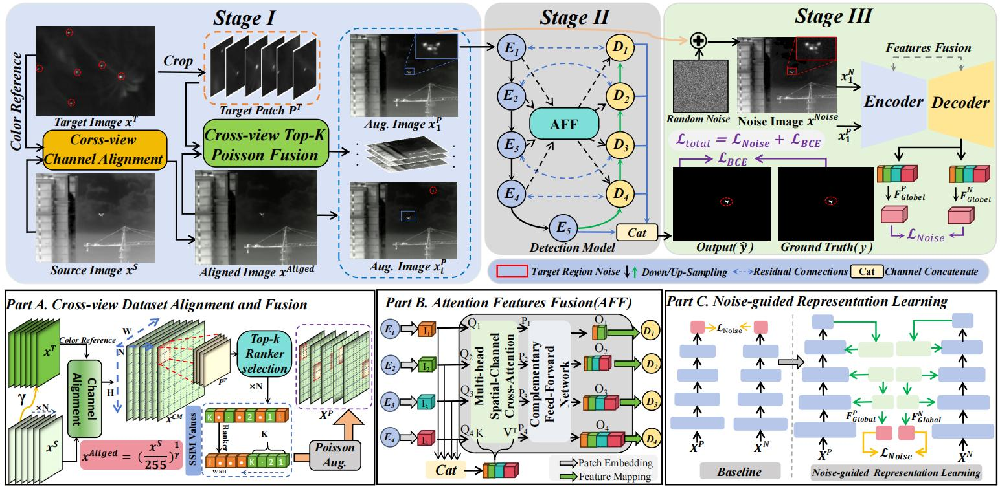
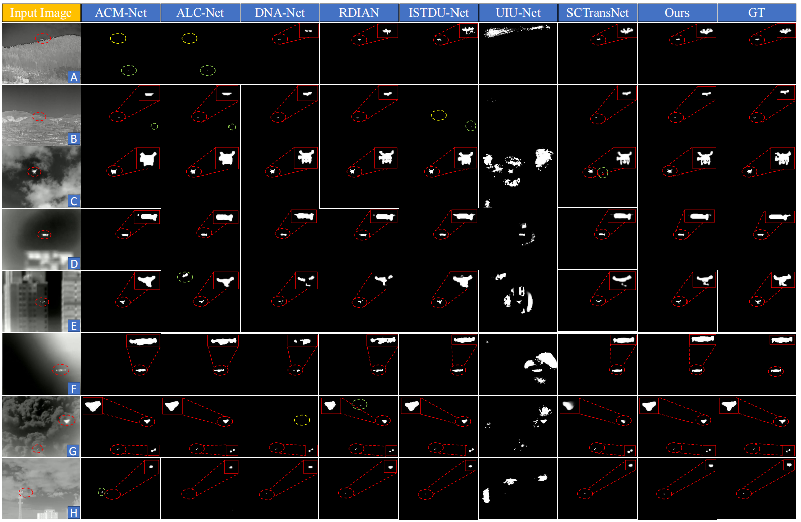

# RealScene-ISTD


***Rethinking Generalizable Infrared Small Target Detection: A Real-scene Benchmark and Cross-view Representation Learning***


## Contents
- [Introduction](#introduction)
  - [Overview](#overview)
  - [Visual](#visual)
- [Dependencies and Installation](#dependencies-and-installation)
- [Dataset](#dataset )
- [Codes Demos](#codes-demos)
- [Usage](#usage)
- [Quantative Results ](#quantative-results)
- [Citations ](#citation)
- [Acknowledgement ](#acknowledgement)


## Introduction
### Overview



### Visual



## Dependencies and Installation
- Following [SCTransNet](https://github.com/xdFai/SCTransNet)
- Python == 3.8
- pip3 install torch torchvision torchaudio --index-url https://download.pytorch.org/whl/cu118

## Dataset 

Download the dataset RealScene-ISTD：Download dir[[Baidu Drive](https://pan.baidu.com/s/1BAY9N4xEtw57_v3TjHrSpg?pwd=trnh]. 
* **The following structure:**
 ```
  ├──./datasets/
  │    ├── RealScene-ISTD
  │    │    ├── images
  │    │    │    ├── 000001.png
  │    │    │    ├── 000002.png
  │    │    │    ├── ...
  │    │    ├── masks
  │    │    │    ├── 000001.png
  │    │    │    ├── 000002.png
  │    │    │    ├── ...
  │    │    ├── img_idx
  │    │    │    ├── train_RealScene-ISTD.txt
  │    │    │    ├── test_RealScene-ISTD.txt
 ```

## Codes Demos

**Gamma_Correction**

```bash
# Run gamma_correction.py directly
python Dataset_Alignment/gamma_correction.py
```

**Topk_Fusion**

```bash
# Run Topk_Fusion directly
python Dataset_Alignment/Topk_Fusion.py
```
You can use our pre-prepared [small target patches](https://pan.baidu.com/s/1zSDV6cw2xcciaKpxpurXdQ?pwd=vjkb).

## Usage

#### 1. Train.

```bash
python train.py
```
#### 2. Test.
```bash
python test.py
```


## Quantitative Results
### Test on RealScene-ISTD
| Method    | mIoU (x10(-2)) | Pd (x10(-2))|  Fa (x10(-6)) ||
| ------------- |:-------------:|:-----:|:-----:|:-----:| 
|ACM-Net |64.25|91.97|250.79||        
|ALC-Net |68.88 |90.91 |146.85  ||                       
| DNA-Net|73.79 | 91.33| 60.06  || 
|RDIAN |59.46 |90.70   |357.92 ||          
|ISTDU-Net |74.40 |93.87  | 75.35  ||           
| UIU-Net| 31.75|89.43|2928.64  ||              
| SCTransNet|75.01|94.29|53.59|| 
|  Ours | 79.32| 96.83 |5.40 |[[Weights]](https://pan.baidu.com/s/1Cf85MTOXSM_9ZKfZ1Z-BDA?pwd=fxvr)|

### Test on IRSTD-1K
| Method    | mIoU (x10(-2)) | Pd (x10(-2))|  Fa (x10(-6)) ||
| ------------- |:-------------:|:-----:|:-----:|:-----:| 
|ACM-Net|57.68|92.23 |115.28 ||                    
|ALC-Net|62.69    |92.28 |58.99   ||                        
|DNA-Net|64.14  | 95.64| 40.90    || 
|RDIAN|60.12 |93.96     |98.88 ||          
|ISTDU-Net|63.20 |96.98 | 14.36  ||           
|UIU-Net| 39.10  |92.62|7008.86  ||              
|SCTransNet|66.93|93.96|15.45|| 
|Ours| 72.44| 95.30   |14.08 |[[Weights]]()|


## Acknowledgement
This project is build based on [SCTransNet](https://github.com/xdFai/SCTransNet). Thanks to Shuai Yuan.

The comparative experiments of our method with other methods are based on [BasicIRSTD](https://github.com/XinyiYing/BasicIRSTD). Thanks to Xinyi Ying.


